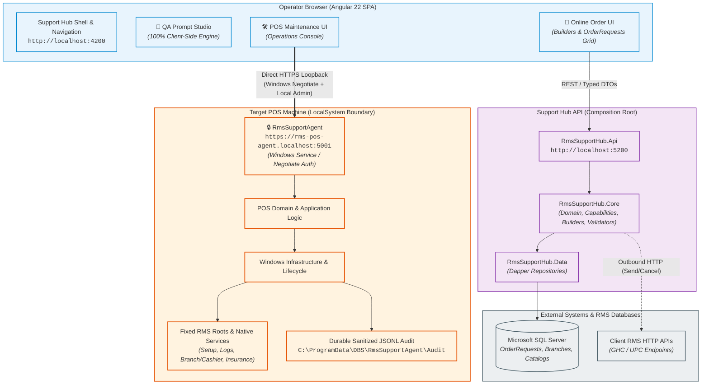

<p align="center">
  <picture>
    <source media="(prefers-color-scheme: dark)" srcset="assets/CompanyLogos/Rms_Plus_Dark.svg">
    <source media="(prefers-color-scheme: light)" srcset="assets/CompanyLogos/Rms_Plus_Light.svg">
    
  </picture>
</p>

# RMS+ Support Hub

> **A unified QA engineering and RMS support workspace.**

[](https://dotnet.microsoft.com/)
[](https://learn.microsoft.com/dotnet/csharp/)
[](https://angular.dev/)
[](https://www.typescriptlang.org/)
[](https://www.microsoft.com/sql-server)
[](https://github.com/DapperLib/Dapper)
[](https://material.angular.io/cdk)
[](https://www.openapis.org/)
[](https://threejs.org/)
[](https://learn.microsoft.com/powershell/)
[](https://www.microsoft.com/windows)

---

## 🏠 Overview

**RMS+ Support Hub** is an internal engineering and support workspace designed for QA professionals, support engineers, and RMS operators. It eliminates fragmented scripts, manual SQL queries, ad-hoc payload assemblers, and unmanaged diagnostic tools by unifying daily operational capabilities into a single, cohesive, token-driven web application.

The platform provides three core operational pillars:

1. **QA Productivity Tooling** — Fast, deterministic, client-side QA prompt engineering and defect refinement with structured formats for Jira, Azure DevOps, and Markdown.
2. **Online Order Operations** — An end-to-end integration workbench supporting multiple RMS client APIs (GHC, UPC, Uni-Commerce) with server-owned payload building, branch/item lookup, live totals calculation, and real-time SQL Server request inspection.
3. **Secure POS Diagnostics & Maintenance** — A dedicated operations console backed by the permanent `RmsSupportAgent` Windows service, featuring direct browser-to-Agent HTTPS loopback communication, Windows Negotiate authentication, fixed-root health monitoring, and safe Support Bundle generation.

| Tool | Route | Primary Capability | State |
|---|---|---|---|
| **QA Prompt Studio** | `/tools/prompt-studio` | Structured prompt generation, defect refinement, test case creation | ✅ Available |
| **Online Order Tool** | `/tools/online-orders` | Order & invoice payload builder, lookup, calculations, `OrderRequests` history | ✅ Available |
| **POS Maintenance Tool** | `/tools/pos-maintenance` | Service monitoring, RMS fixed-root diagnostics, update state, Support Bundles | 🧪 Testing (Secure Agent) |

---

## 🧩 Platform Tools

### 🧪 1. QA Prompt Studio

**QA Prompt Studio** standardizes defect reporting, user story refinement, and test case authoring into deterministic, high-quality prompts optimized for development teams and AI assistants.

* **Bug Refinement (11 Sections)** — Generates comprehensive defect reports containing Title, Summary, Severity/Priority, Environment, Preconditions, Step-by-step Reproduction, Expected vs. Actual results, Root Cause Hypothesis, Workarounds, Evidence/Attachments, and Acceptance Criteria.
* **Story Refinement (7 Sections)** — Structures requirement analysis into User Story, Business Value, Acceptance Criteria, Edge Cases, Out of Scope, Dependencies, and QA Notes.
* **Test Case Generation (9 Sections)** — Authors detailed test scenarios with Test ID, Description, Preconditions, Test Data, Execution Steps, Expected Results, Postconditions, Automation Feasibility, and Tags.
* **Multi-Format Export** — Instant rendering and clipboard export to **Generic Markdown**, **Jira markup**, and **Azure DevOps Markdown**.
* **Advisory Quality Feedback** — Built-in, deterministic heuristics analyze prompt completeness, structure, and clarity, providing instant visual indicators without interrupting user workflow.
* **100% Client-Side Privacy Boundary** — Generation occurs entirely inside the operator's browser. No data is transmitted to external AI providers or cloud APIs. Attachment contents are never stored, and local history is capped at ten recent drafts stored in browser `localStorage`.

---

### 🛒 2. Online Order Tool

**Online Order Tool** is an operations and testing workbench for building, validating, submitting, and inspecting online orders across multiple client RMS integration families.

#### Supported Integration Families

* **GHC E-Commerce (`ghc_ecommerce`)** — Flat order builder with client identity, branch-aware product lookups, consumer lookups, delivery charge fields, direct order submission (`POST /api/modules/ghc_ecommerce/send-request`), and ad-hoc order cancellation.
* **UPC E-Commerce (`upc_ecommerce`)** — Flat order builder supporting dual **Testing** and **Production** environments, branch-aware item lookups, consumer lookups, direct submission, server-enforced cancellation, live `OrderRequests` history, and same-number order resending.
* **GHC Uni-Commerce (`ghc_unicommerce`)** — Specialized invoice payload builder supporting invoice headers, consumer details, multi-row items, return order logic (`IsReturn`), parent invoice references, and server-calculated totals.
* **OMS & Call Center (`oms`, `call_center`)** — Registered placeholder modules prepared for upcoming integration contracts.

#### Key Capabilities & Architecture

* **Server-Owned Calculations** — Authoritative totals, VAT calculations, delivery fees, and remaining balance computations are performed by the backend `TotalsCalculator`, ensuring complete mathematical consistency between UI display and submitted payloads.
* **Compiled JSON Payload Preview** — Operators can inspect the exact, compiled JSON payload generated by `module.BuildPayload(draft)` before dispatch. An empty payment list is the verified, explicit contract for Cash on Delivery (COD) transactions.
* **Order Requests Workbench** — Direct, real-time inspection of the SQL Server `OrderRequests` table:
  * Fast list queries selecting execution metadata without loading large JSON blobs into memory.
  * Search by exact or escaped partial order number, last-9-digit mobile phone number, branch code, date ranges, and multi-select status chips.
  * Route-level detail view (`/tools/online-orders/modules/:key/order-requests/:id`) displaying full `RequestJson`, `ResponseJson`, rejection messages, execution attempts, and request lineage.
  * **Server-Enforced Cancellation** — Blocks cancellations on terminal statuses (`{5, 6, 7, 9}` — Rejected, CanceledByClient, CanceledByAdmin, Done).
  * **Same-Number Resend** — Reuses the stored request payload, preserves custom attributes, allows branch overrides, and re-submits under the original order code.
* **Safe Environment Separation** — Testing is the default mode. Production mode routes to the dedicated `RmsMainProd` catalog via server-owned connection settings; operators cannot override connection strings or server endpoints from the browser.

#### Module Capability Matrix

| Module Key | Display Name | Order Builder | Invoice Builder | Item / Consumer Lookup | Delivery Fields | Order Requests | Cancel / Resend | Status |
|---|---|:---:|:---:|:---:|:---:|:---:|:---:|---|
| `upc_ecommerce` | UPC E-Commerce | ✅ | — | ✅ | — | ✅ | ✅ / ✅ | ✅ Active (Testing & Prod) |
| `ghc_ecommerce` | GHC E-Commerce | ✅ | — | ✅ | ✅ | ⏳ | ✅ / — | ✅ Active (Lookup & Send) |
| `ghc_unicommerce` | GHC Uni-Commerce | — | ✅ | — | — | ⏳ | — / — | 🚧 Registered |
| `oms` | OMS | — | — | — | — | — | — / — | 📋 Placeholder |
| `call_center` | Call Center | — | — | — | — | — | — / — | 📋 Placeholder |

---

### 🛠️ 3. POS Maintenance Tool

**POS Maintenance Tool** (delivered in **Slice C**) is a dedicated local operations console providing health monitoring, diagnostics, safe Support Bundles, and guided maintenance for point-of-sale terminals.

#### Delivered Architecture & Security Model

* **Permanent Service Identity** — Hosted exclusively by the permanent Windows Service `RmsSupportAgent` (Display Name: `RMS Support Agent`, Service Account: `LocalSystem`). Historical testing service names are retained strictly as migration inputs.
* **Direct Browser-to-Agent Loopback Boundary** — The operator's browser communicates directly with the local Agent at `https://rms-pos-agent.localhost:5001` over HTTPS loopback with Windows Negotiate (IWA) authentication and local Administrator authorization. **The general Support Hub API is NOT a privileged relay.**
* **Operational Health Diagnostics (`GET /api/v1/rms/operational-health`)** — An authenticated, read-only projection inspecting fixed, server-owned RMS directory roots:
  * Setup, download, and component repository directories.
  * Branch and Cashier runtime databases, configuration files, and native logs.
  * Insurance attachment storage (`C:\ProgramData\DBS\POS`) returning aggregate counts and byte sizes only.
  * Reparse points and directory traversals are strictly rejected. No raw file paths, filenames, patient identifiers, or attachment contents are exposed.
* **RMS Service Monitoring** — Probes native RMS services (`RMS.BranchService`, `RMS.CashierService`). Native product services—most notably `RMSServiceManager`—are never adopted, stopped, or deleted.
* **Durable Sanitized JSONL Audit** — Sensitive operations append structured, bounded audit entries to `C:\ProgramData\DBS\RmsSupportAgent\Audit`. The audit stream is access-controlled and sanitized against secret leakage.
* **Safe Support Bundle** — Generates manifest-driven, redacted diagnostic archives combining service states, connectivity checks, database recovery status, and recent audit summaries. Never packages private keys, certificates, credentials, raw logs, or attachment data.
* **Plan-First Deployment Lifecycle** — Deployment and lifecycle scripts (`Status`, `PlanOnly`, `Install`, `Upgrade`, `Repair`, `Uninstall`, `Rollback`) enforce package signing verification, SHA-256 manifests, and explicit browser/certificate policy. The installer fails closed without writing machine changes if trust criteria are unmet.

---

## 🏗️ Architecture

RMS+ Support Hub enforces a strict separation of concerns across its browser frontend, central backend API, and isolated machine-local POS agent.



> **Crucial Security Distinction**: The central Support Hub API is **not** a privileged proxy or relay for POS operations. The browser establishes a direct, authenticated HTTPS connection to the local `RmsSupportAgent` on loopback port 5001.

---

## 🛡️ Security by Design

Security and boundary integrity are fundamental design requirements of RMS+ Support Hub:

* **Zero Committed Secrets** — `appsettings.json` contains only empty connection-string placeholders. Credentials are injected via .NET user-secrets in development and environment variables in deployed instances.
* **Server-Derived Connection Authority** — The browser can select named environment keys (e.g., `"UPC Testing"`, `"UPC Production"`), but cannot provide server addresses, database catalogs, or connection strings. Production switches point strictly to the pre-approved `RmsMainProd` catalog.
* **Direct Browser-to-Agent Boundary** — Privileged POS maintenance runs on the local machine via `RmsSupportAgent`. The central API never receives or routes POS commands.
* **Windows Negotiate & Local Admin Authorization** — All POS Agent endpoints authenticate the calling Windows user via Kerberos/NTLM and require membership in the local `Administrators` group.
* **No Arbitrary Execution** — The platform contains no generic command execution, no arbitrary PowerShell invokers, no dynamic SQL runners, and no unvalidated service-name controls.
* **Privileged Mutation Lease** — Machine-modifying operations are serialized across the entire host via the named system mutex `Global\RmsSupportHub.Pos.Agent.PrivilegedMutationLease`.
* **Bounded Fixed RMS Roots** — Filesystem inspection is hardcoded to known RMS paths. Reparse points (junctions/symlinks) are detected and rejected to prevent directory traversal.
* **Metadata-Only Insurance Processing** — Insurance attachment storage (`C:\ProgramData\DBS\POS`) is evaluated for count and total byte metrics only. File names, binary attachments, and patient identifiers never leave the disk.
* **Sanitized Support Bundles & Audit** — Diagnostic bundles and JSONL audit logs strip connection strings, tokens, passwords, private keys, and raw payload data.
* **Package Signing & Trust Boundaries** — Agent deployment manifests require schema 1 validation, SHA-256 file hashes, architecture verification, and trusted code signing before execution.

---

## ⚙️ Technology Stack

| Layer / Area | Technology | Version | Purpose |
|---|---|---|---|
| **Frontend Framework** | **Angular** | `22.0.0` | Standalone components, signals, typed forms, lazy feature routing |
| **Frontend Language** | **TypeScript** | `6.0.2` | Strong type safety across models, DTOs, and generated contracts |
| **Component Primitives** | **Angular CDK** | `22.0.6` | Overlays, virtual scroll, accessibility, and focus management |
| **Decorative Graphics** | **Three.js** | `0.185.1` | Dynamic, lazy-loaded WebGL Hub scene (aria-hidden, reduced-motion safe) |
| **Frontend Testing** | **Vitest** | `4.0.8` | High-speed unit and component test suite |
| **Design System** | **CSS Custom Properties** | — | Strict design token architecture (`_tokens.css`, `_gradients.css`) |
| **Central Backend API** | **ASP.NET Core Web API** | `.NET 10.0` | Controller layer, request validation, draft management, composition root |
| **Backend Language** | **C#** | `14` | Nullable reference types, records, pattern matching |
| **Database Access** | **Dapper** | `2.1.79` | High-performance, parameterized SQL Server data mapping |
| **SQL Driver** | **Microsoft.Data.SqlClient** | `7.0.2` | Secure, direct SQL Server database connectivity |
| **API Documentation** | **OpenAPI & Scalar** | `3.1` / `2.16` | Typed contract generation and non-production interactive API explorer |
| **Backend Testing** | **xUnit & Moq** | `2.9.3` / `4.20` | Core domain, contract fixture, and controller integration tests |
| **Local POS Agent** | **ASP.NET Core Windows Service** | `.NET 10.0` | Headless, Windows-hosted POS diagnostics and maintenance daemon |
| **Agent Authentication** | **Windows Negotiate (IWA)** | `10.0.10` | Kerberos / NTLM authentication with local Administrator role validation |
| **Deployment Automation** | **PowerShell & Pester** | `5.1 / 7+` | Quality-checked lifecycle scripts (`.ps1`/`.psm1`) and Pester test suites |

---

## 📊 Capability & Maturity Matrix

| Area | Capability | Status | Notes |
|---|---|:---:|---|
| **QA Prompt Studio** | Bug, Story, and Test Case Generators | ✅ Available | 100% client-side, Generic/Jira/ADO markdown formats |
| | Advisory Prompt Quality Scoring | ✅ Available | Local deterministic heuristic engine |
| | Draft Management & Local History | ✅ Available | Capped 10-record browser `localStorage` history |
| **Online Ordering** | Flat Order Builder (GHC & UPC) | ✅ Available | Client selection, branch/item lookup, live server totals |
| | Uni-Commerce Invoice Builder | ✅ Available | Header, consumer, line items, and return order logic |
| | Cash on Delivery (COD) Contract | ✅ Available | Verified empty-payment list representation |
| | Live Payload Preview & Export | ✅ Available | Exact server-compiled JSON preview |
| **Order Requests** | SQL Server History Workbench | ✅ Available | Exact/partial search, phone search, status filtering, stat tiles |
| | Request Detail & Lineage | ✅ Available | Full payload inspection, attempts, and rejection messages |
| | Server-Enforced Cancellation | ✅ Available | Status-guarded (`{5,6,7,9}` blocked) cancellation workflow |
| | Same-Number Order Resend | ✅ Available | Resends stored payload with optional branch override |
| **POS Maintenance** | Operations Console UI | ✅ Available | Token-driven console with signal-to-action layout |
| | Permanent Service Architecture | ✅ Available | Permanent `RmsSupportAgent` Windows service identity |
| | Direct Browser-to-Agent Loopback | ✅ Available | Exact HTTPS origin, Negotiate auth, local Admin authorization |
| | Fixed-Root RMS Health Diagnostics | ✅ Available | Read-only summary of setup, downloads, branch/cashier roots |
| | Safe Insurance Aggregate Metrics | ✅ Available | Aggregate counts and bytes only; zero attachment contents |
| | Durable Sanitized JSONL Audit | ✅ Available | Bounded, access-controlled audit logging |
| | Safe Support Bundle Generation | ✅ Available | Redacted diagnostic bundle without secrets or raw payloads |
| | Plan-First Lifecycle Scripts | ✅ Available | Bounded `Status`, `PlanOnly`, `Install`, `Repair`, `Rollback` |
| **Release Gates** | Automated Unit & Integration Tests | ✅ Passed | 360+ frontend tests, 330+ POS tests, 190 backend tests |
| | Elevated Testing Machine Proof | ⏳ Pending Evidence | Requires execution on authorized Testing machine with elevation |
| | Production Code Signing & PKI | ⏳ Pending Evidence | Requires enterprise PKI certificate issuance and signing pipeline |
| | Fleet Rollout & Customer Approval | ⏳ Pending Evidence | Pending independent security review and production release approval |

---

## 🚀 Getting Started

### 1. Prerequisites

* [.NET 10 SDK](https://dotnet.microsoft.com/download/dotnet/10.0)
* [Node.js](https://nodejs.org/) (v18 or higher) and `npm`
* [PowerShell](https://learn.microsoft.com/powershell/) (v5.1 or PowerShell 7+)

### 2. Configuration & Secrets

No connection strings or credentials are committed to the repository. Configure your local .NET user-secrets for `RmsSupportHub.Api`:

```powershell
cd backend/src/RmsSupportHub.Api
dotnet user-secrets set "ConnectionStrings:GhcEcommerce"     "Server=<host>;Database=<db>;User Id=<user>;Password=<pwd>;TrustServerCertificate=True;"
dotnet user-secrets set "ConnectionStrings:UpcEcommerceTest" "Server=<host>;Database=<db>;User Id=<user>;Password=<pwd>;TrustServerCertificate=True;"
dotnet user-secrets set "ConnectionStrings:GhcUnicommerce"   "Server=<host>;Database=<db>;User Id=<user>;Password=<pwd>;TrustServerCertificate=True;"
dotnet user-secrets list
```

In deployed environments, provide the corresponding environment variables: `CONNECTIONSTRINGS__GHCECOMMERCE`, `CONNECTIONSTRINGS__UPCECOMMERCETEST`, and `CONNECTIONSTRINGS__GHCUNICOMMERCE`.

### 3. Running Locally

To launch both the backend API (`http://localhost:5200`) and the Angular development server (`http://localhost:4200`) simultaneously:

```powershell
.\scripts\dev.ps1
```

Alternatively, run each process in a separate terminal:

```powershell
# Terminal 1 — Backend API
cd backend
$env:ASPNETCORE_ENVIRONMENT = "Development"
dotnet run --project .\src\RmsSupportHub.Api --urls "http://localhost:5200"

# Terminal 2 — Frontend SPA
cd frontend
npm ci
npm start -- --host localhost --port 4200
```

Open `http://localhost:4200` in your browser. The Angular dev server automatically proxies `/api` calls to `http://localhost:5200`.

### 4. Testing & Validation

Run the consolidated build and test gate:

```powershell
.\scripts\build.ps1
```

Individual test suites:

```powershell
# Backend tests
dotnet test backend/RmsSupportHub.slnx -c Release --nologo

# POS tests
dotnet test pos/RmsSupportHub.Pos.slnx -c Release --nologo

# Frontend tests & production build
cd frontend
npm test -- --watch=false
npm run build -- --configuration production
npm run test:riyal-asset
```

### 5. POS Agent Planning & Testing

To inspect the local Agent status and plan deployment without making system changes:

```powershell
.\scripts\bootstrap-rms-support-agent.ps1 -Status
.\scripts\bootstrap-rms-support-agent.ps1 -PlanOnly -Channel Testing
```

*For detailed instructions on running and operating the workspace, see [RUN.md](RUN.md).*

---

## 📚 Documentation Map

The repository maintains concise, load-bearing documentation across all core subsystems:

### 🏛️ Architecture & Structure
* **[docs/README.md](docs/README.md)** — Master documentation index and governance overview.
* **[docs/REPOSITORY_STRUCTURE.md](docs/REPOSITORY_STRUCTURE.md)** — Directory layout, architectural layers, and component placement rules.
* **[.ai/PROJECT.md](.ai/PROJECT.md)** — Stable architectural context and engineering invariants.

### 📜 Contracts & Specifications
* **[docs/api-spec.md](docs/api-spec.md)** — REST API specification for module management, drafts, lookups, and Order Requests.
* **[docs/database-schema.md](docs/database-schema.md)** — Authoritative SQL Server table schemas and query contracts.
* **[docs/request_examples/](docs/request_examples/)** — Reference JSON payloads governing client RMS integrations.

### 🛠️ POS Maintenance & Agent
* **[docs/POS_SLICE_C_IMPLEMENTATION.md](docs/POS_SLICE_C_IMPLEMENTATION.md)** — Slice C implementation status, security model, and evidence classification.
* **[docs/POS_SLICE_C_REQUIREMENTS.md](docs/POS_SLICE_C_REQUIREMENTS.md)** — Acceptance criteria and requirements for POS Slice C.
* **[docs/POS_RUNTIME_AND_MAIN_SERVER_API_DISCOVERY.md](docs/POS_RUNTIME_AND_MAIN_SERVER_API_DISCOVERY.md)** — Fixed RMS roots, registry allowlist, and runtime discovery.
* **[docs/POS_SLICE_B_BOUNDARY.md](docs/POS_SLICE_B_BOUNDARY.md)** — POS Slice B architectural boundary and mutation leasing.
* **[docs/POS_MAINTENANCE_INTEGRATION_PLAN.md](docs/POS_MAINTENANCE_INTEGRATION_PLAN.md)** — Cross-project POS architecture and ownership boundaries.

### 🎨 Design System & UI
* **[docs/design-system.md](docs/design-system.md)** — Design tokens, card contracts, theming engine, and Three.js scene guidelines.

### 🚀 Operations & Deployment
* **[RUN.md](RUN.md)** — Local execution guide for developers and testers.
* **[docs/MANUAL_IIS_DEPLOYMENT.md](docs/MANUAL_IIS_DEPLOYMENT.md)** — Manual IIS packaging and staging procedure.
* **[docs/RMS_SUPPORT_HUB_RELEASE_READINESS.md](docs/RMS_SUPPORT_HUB_RELEASE_READINESS.md)** — Release-candidate validation record, deferred items, and preconditions.
* **[docs/sql/order-requests-performance-indexes.sql](docs/sql/order-requests-performance-indexes.sql)** — Recommended SQL Server performance indexes for `OrderRequests`.

---

<p align="center">
  <sub>RMS+ Support Hub • Designed & Maintained for RMS QA & Operations</sub>
</p>
